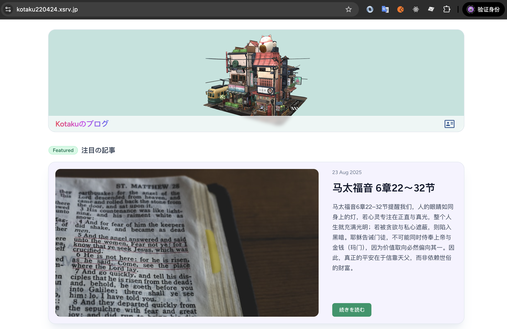
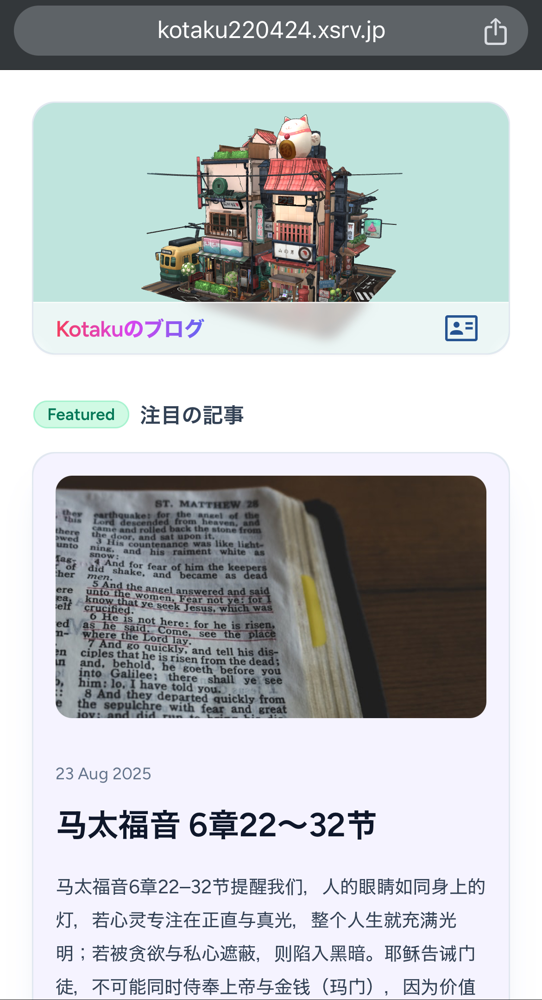

# Kotaku Blog

📖 **Kotaku のブログ**
一个基于 **Laravel + Canvas + Vue3** 开发的个人博客系统。
支持响应式布局，提供 **PC 端** 和 **移动端** 的优雅阅读体验。

---

## ✨ 功能特色
- 使用 [Laravel](https://laravel.com/) 作为后端框架
- 使用 [Canvas](https://cnvs.io/) 作为内容管理基础
- 前端采用 [Vue 3](https://vuejs.org/) + [Inertia.js](https://inertiajs.com/) 构建
- 集成 Tailwind CSS，轻量美观的 UI 设计
- 响应式布局，兼容 PC / Mobile

---

## 📷 截图预览

### PC 端


### Mobile 端


---

## 🛠 技术栈
- **Backend**: Laravel 10 + Canvas
- **Frontend**: Vue 3 + Inertia.js + Tailwind CSS
- **Build Tool**: Vite
- **Database**: MySQL (or SQLite for dev)

---

## 🚀 快速开始

### 环境要求
- PHP >= 8.3
- Composer
- Node.js >= 18
- MySQL

### 安装步骤
```bash
# 克隆项目
git clone https://github.com/yourname/your-blog.git
cd your-blog

# 安装后端依赖
composer install

# 安装前端依赖
npm install

# 复制环境配置
cp .env.example .env

# 生成应用 key
php artisan key:generate

# 数据库迁移
php artisan migrate

# 启动开发服务
php artisan serve
npm run dev
